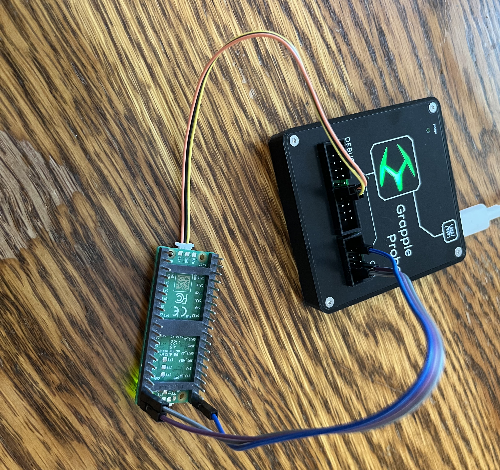
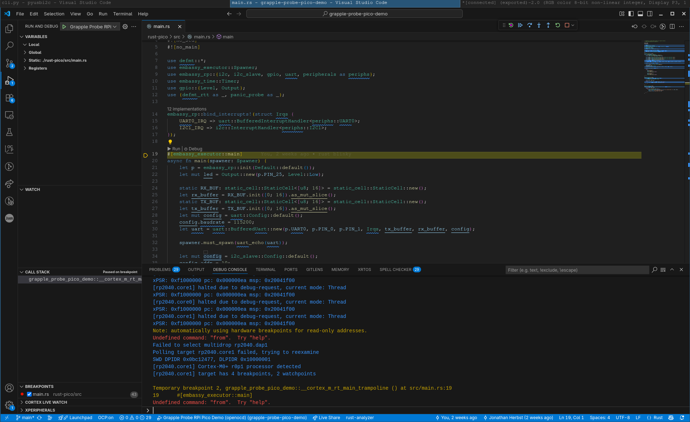

# Grapple Probe Demo for RPi Pico

This project contains a demo to show how to use the Grapple Probe to debug a Raspberry Pi Pico 1.

## Connecting the Pico

The Pico comes with or without headers soldered on, the version with headers (Pico H) has a JST connector for the debug pins, and the version without headers (Pico) has through hole joints for the debug pins.  For the purpose of the demo a Pico H is used with an adapter like [this](https://www.adafruit.com/product/5765).



1) Connect a ground pin on the Grapple Probe to the ground on the Pico.
2) Connect the SWD pins on the Grapple Probe to the debug pins on the Pico.  DEBUG pin 9 to the SWCLK pin on the Pico, and DEBUG pin 7 to the SWDIO pin on the Pico.
3) Connect the uart pins on the Grapple Probe to the uart pins on the Pico. COM pin 1 to pin 1 (GP0/UART0_TX) on the Pico, and COM pin 2 to pin 2 (GP1/UART0_RX) on the Pico.
4) Connect power using either the 5 V Key from the Grapple Probe, or connect the USB port on the Pico.  For 5 V Key connect either DEBUG pin 19 or COM pin 7 to pin 40 (VBUS) on the Pico.

## rust-pico

Prerequisites:

1. [Install rust](https://rust-lang.org/tools/install/)
2. Install the target for the Pico

    ``` sh
    rustup target add thumbv6m-none-eabi
    ```

3. [Install probe-rs](https://probe.rs/docs/getting-started/installation/) a nice tool for running embedded software with rtt logging!

``` sh
$ cargo run
   Compiling proc-macro2 v1.0.103
   Compiling quote v1.0.42
   Compiling unicode-ident v1.0.22
   Compiling defmt v1.0.1
   Compiling typenum v1.19.0
   Compiling thiserror v2.0.17
   Compiling defmt-macros v1.0.1
   ...
   Compiling embedded-io v0.6.1
   Compiling embassy-usb-driver v0.2.0
   Compiling embassy-embedded-hal v0.5.0
   Compiling pio-parser v0.3.0
   Compiling pio-proc v0.3.0
   Compiling pio v0.3.0
    Finished `dev` profile [unoptimized + debuginfo] target(s) in 25.85s
     Running `probe-rs run --chip RP2040 target/thumbv6m-none-eabi/debug/grapple-probe-pico-demo`
      Erasing ✔ 100% [####################]  76.00 KiB @  64.15 KiB/s (took 1s)
  Programming ✔ 100% [####################]  76.00 KiB @  42.89 KiB/s (took 2s)
     Finished in 2.97s
0.010741 [INFO ] led on! (grapple_probe_pico_demo rust-pico/src/main.rs:35)
1.011335 [INFO ] led off! (grapple_probe_pico_demo rust-pico/src/main.rs:39)
2.011679 [INFO ] led on! (grapple_probe_pico_demo rust-pico/src/main.rs:35)
3.011963 [INFO ] led off! (grapple_probe_pico_demo rust-pico/src/main.rs:39)
4.012235 [INFO ] led on! (grapple_probe_pico_demo rust-pico/src/main.rs:35)
5.012507 [INFO ] led off! (grapple_probe_pico_demo rust-pico/src/main.rs:39)
6.012770 [INFO ] led on! (grapple_probe_pico_demo rust-pico/src/main.rs:35)
```

With the uart pins connected the Pico acts as a serial echo device at 115200 baud.  Screen, minicom, or putty are good options for trying out the serial functionality and the Pico echos back everything typed.

```sh
screen /dev/ttyACM0 115200

Hello World!
```

### VSCode Debugging

Prerequisites:

- [Cortex Debug](https://marketplace.visualstudio.com/items?itemName=marus25.cortex-debug) (External dependencies needed, [ARM GCC Toolchain](https://developer.arm.com/open-source/gnu-toolchain/gnu-rm/downloads) and [OpenOCD >=0.12](http://openocd.org/))

With the extensions and prerequisites installed you can run the premade launch configurations to start debugging.

1. Navigate to the "Run and Debug" tab.
2. Select "Grapple Probe RPi Pico Demo (openocd)" from the dropdown
3. Press the Play button

At this point you should be greeted with the VSCode debugging interface and you can set breakpoints, step through code, inspect registers, and more.


